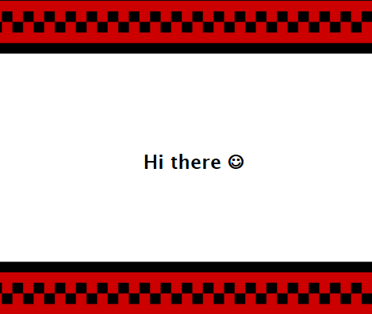

# TextureMe ... me too!

Ever wanted to give someone a special message with a more personalized look and feel?
TextureMe was a little web project utilizing Canvas and HTML to provide a serverless experience.




## How it basically works

All necessary data is stored as JSON as URL-Hash and allows the project to be therefore stateless. It is possible to use barebone JSON as Hash in a Url, but it is not recommended, as e.g. messengers might not be able to detect the complete url properly. For that reason, a method is provided to use base64 to encode that data somewhat properly.


## Get started!

You might want to checkout https://raspyweather.github.io/textureMe/index.html and change ```index.html``` to ```edit.html``` to checkout its capabilities and experiment on your own 
